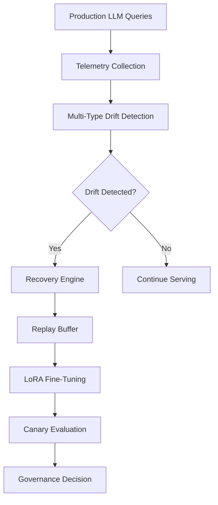

# LLM Drift Detection & Adaptation Pipeline

**Proactive Governance for Production LLMs: Detect, Recover, and Adapt to Model Drift in Real-Time**

---

## Project Overview

Large Language Models (LLMs) deployed in production experience **drift** — gradual degradation in performance due to changing user behavior, domain shifts, or evolving world knowledge. This project presents a complete **agentic observability and adaptation system** that automatically detects multiple types of drift, recovers high-quality responses, and continuously fine-tunes the model using LoRA adapters.

Built as production-grade research, it demonstrates how to maintain LLM reliability at scale through intelligent monitoring, automated recovery, and governed model updates.

### The Problem It Solves
Traditional MLOps for LLMs is reactive. This pipeline shifts to **proactive governance**, catching drift early, recovering from failures, and safely adapting models without catastrophic forgetting or quality regression.

---

## Key Features

- **Multi-Dimensional Drift Detection**: Semantic, lexical, domain, contextual, and performance drift using adaptive thresholds.
- **Intelligent Recovery Engine**: LLM-powered strategies to generate improved responses for drifted queries.
- **Replay Buffer Management**: Curated storage of high-value (recovered) examples for safe adaptation.
- **LoRA Fine-Tuning Pipeline**: Parameter-efficient adaptation (0.09% of model parameters) on recovered data only.
- **Automated Governance**: Quality + latency tradeoff analysis with explainable promotion decisions.
- **Real-Time Monitoring**: Streaming telemetry, visualizations, and comprehensive reporting.
- **Canary Evaluation**: Safe A/B testing before production promotion.

---

## Tech Stack

- **Language**: Python 3.12
- **LLM Framework**: Hugging Face Transformers, PEFT (LoRA)
- **Drift Detection**: Custom semantic similarity, lexical analysis, statistical thresholds
- **Data Handling**: pandas, NumPy
- **Visualization**: Matplotlib, Seaborn
- **Evaluation**: Custom metrics for quality, latency, and safety
- **Environment**: GPU-accelerated (T4), mixed precision training

---

## Technical Architecture

### High-Level Flow

Core Technical Components

Drift Detection: Combines embedding cosine similarity, lexical divergence, domain classifier confidence, and performance regression.
Adaptive Thresholds: Dynamically calculated using rolling statistics and distribution analysis.
Recovery Strategies: Zero-shot prompting, chain-of-thought, and context enrichment via agentic workflows.
LoRA Adaptation: Low-Rank Adaptation with 8-bit quantization and gradient checkpointing for memory efficiency.
Governance Logic: Weighted scoring of quality improvement vs. latency regression with safety guardrails.

Installation & Usage
1. Clone the Repository
git clone https://github.com/yourusername/llm-drift-adaptation-pipeline.git
cd llm-drift-adaptation-pipeline

2. Install Dependencies
pip install torch torchvision torchaudio --index-url https://download.pytorch.org/whl/cu121
pip install transformers peft datasets pandas numpy matplotlib seaborn tqdm

3. Run the Pipeline
jupyter notebook AIDevOps_Draft_6.ipynb
Execute cells sequentially. The pipeline processes telemetry, detects drift, trains adapters, and generates governance reports.

Future Research Roadmap

Phase 1: Integrate continual pre-training with replay-based regularization to prevent catastrophic forgetting.
Phase 2: Add multi-agent recovery orchestration using LangGraph for complex drift scenarios.
Phase 3: Implement federated drift detection across distributed LLM deployments.

Portfolio & Contact
Built by Abhishek — AI Research Engineer & Technical Writer

LinkedIn: [linkedin.com/in/yourprofile](https://www.linkedin.com/in/abhiisheksharrma/)
Email: sharrmaabhishek1@gmail.com
